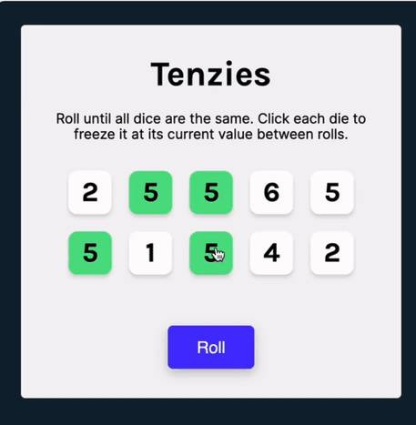

# 🎲 Tenzies Game

A fast-paced and fun dice game built with React. The goal is to roll all ten dice to be the same number.

[🔴 **Live Demo**](https://tenziezzz.netlify.app/)



## 📖 How to Play

1.  **Roll:** Click the "Roll" button to generate new numbers.
2.  **Hold:** Click on a die to "freeze" it at its current value.
3.  **Win:** Keep rolling until all 10 dice are the same number.
4.  **Celebrate:** Enjoy the confetti! 🎉

## 🛠 Built With

* **React** (Hooks: `useState`, `useEffect`)
* **JavaScript** (ES6+)
* **CSS3** (Flexbox/Grid)
* **NanoID** (For unique key generation)
* **React-Confetti** (For the winning effect)

## ✨ Features

* **Random Dice Generation:** Logic to ensure fair randomness.
* **Hold Functionality:** Selective state updates for individual die components.
* **Winning Logic:** Synchronization of two different states (`dice` array and `tenzies` boolean).
* **Responsive Design:** Playable on both desktop and mobile.

## 💻 Installation

To run this project locally, follow these steps:

```bash
# 1. Clone the repository
git clone [https://github.com/YOUR_USERNAME/YOUR_REPO_NAME.git](https://github.com/YOUR_USERNAME/YOUR_REPO_NAME.git)

# 2. Navigate to the project directory
cd tenzies-game

# 3. Install dependencies
npm install

# 4. Start the development server
npm start


